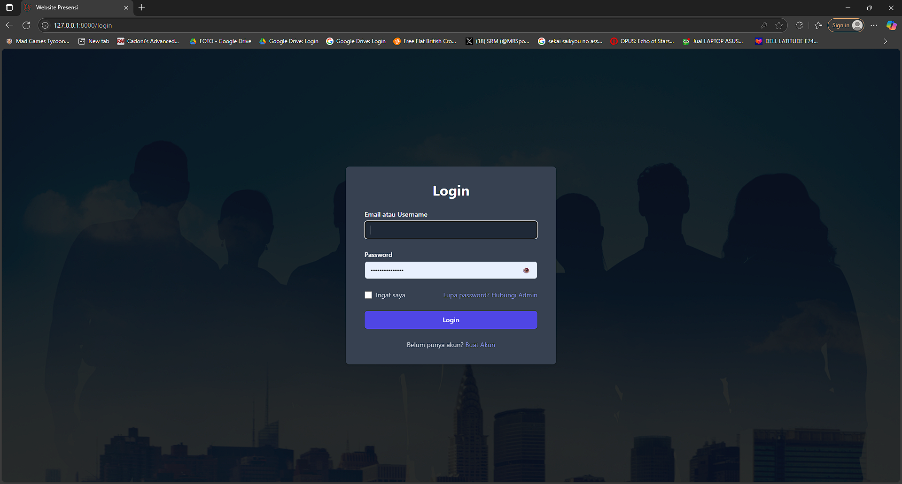
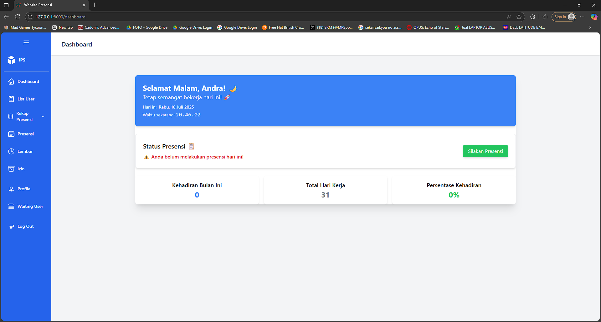
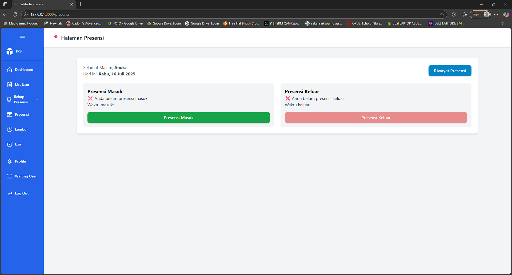
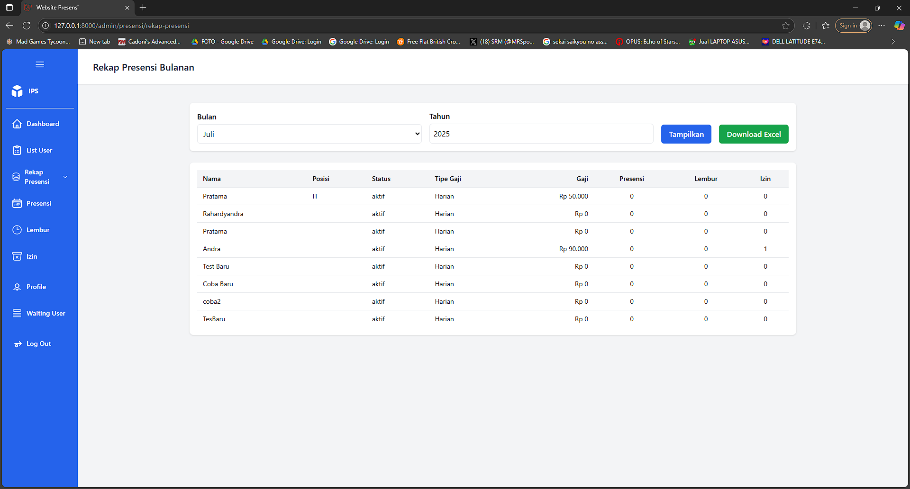

# 💼 Sistem Informasi Presensi dan Penggajian Karyawan

Ini adalah proyek skripsi saya yang berjudul **“Pengembangan Sistem Informasi Presensi dan Penggajian Karyawan Berbasis Web di CV. Irfan Putera Sejahtera”**. Aplikasi ini bertujuan untuk mempermudah pencatatan kehadiran dan penggajian karyawan secara efisien, real-time, dan terintegrasi.

---

## 📌 Fitur Utama

✅ **Manajemen Presensi**
- Pencatatan presensi masuk dan keluar karyawan
- Auto-rekap kehadiran harian dan bulanan
- Fitur keterlambatan dan ketidakhadiran otomatis

✅ **Perhitungan Gaji Otomatis**
- Perhitungan gaji berdasarkan jumlah hari kerja
- Pemotongan gaji karena ketidakhadiran atau keterlambatan
- Slip gaji otomatis untuk setiap karyawan

✅ **Dashboard Interaktif**
- Tampilan ringkasan kehadiran dan penggajian
- Statistik dan grafik data

✅ **Manajemen Akun**
- Login berbasis role (admin & karyawan)
- Manajemen data user dan hak akses

✅ **Laporan & Cetak**
- Laporan presensi dan penggajian yang bisa di-export ke PDF
- Filter laporan berdasarkan bulan/tahun

---

## 🛠️ Teknologi yang Digunakan

| Stack        | Teknologi                        |
|--------------|----------------------------------|
| Backend      | PHP (Laravel 11)                |
| Frontend     | Blade, Tailwind CSS             |
| Database     | MySQL                           |
| Tools        | VS Code, Git, XAMPP, Jetstream              |

---

## 🖥️ Screenshot Aplikasi

### 🔐 Halaman Login


---

### 📊 Dashboard Admin


---

### 📅 Modul Presensi


---

### 📄 Laporan Presensi Bulanan


---

## 🎓 Tentang Proyek

Proyek ini merupakan bagian dari tugas akhir untuk memenuhi salah satu syarat kelulusan pada program studi Teknik Informatika. Proyek ini dikembangkan berdasarkan kebutuhan nyata di CV. Irfan Putera Sejahtera, dengan fokus pada kepraktisan penggunaan dan kemudahan pengelolaan data.

---

## ✍️ Kontributor

*Nama: Rahardyandra Pratama
*Peran: Fullstack Developer (Skripsi)
*Universitas: Universitas Amikom Yogyakarta

---

## 📬 Kontak

Jika ada pertanyaan, masukan, atau kebutuhan demo:

* 📧 Email: [rahardyandra@email.com](mailto:rahardyandra@email.com)
* 💼 LinkedIn: [linkedin.com/in/rahardyandra-pratama](https://linkedin.com/in/rahardyandra-pratama)
* 🐙 GitHub: [github.com/AlzeHazeka](https://github.com/AlzeHazeka)

---

## 📃 Lisensi

Proyek ini digunakan hanya untuk keperluan akademik. Dilarang menggunakan sebagian atau seluruh kode tanpa izin tertulis dari pengembang.

```

